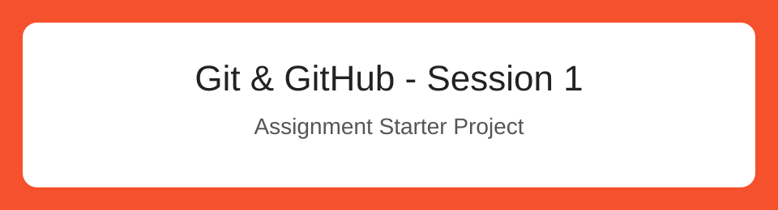

# Git & GitHub Assignment 1

**Name:** Aya Drissi
**GitHub username:** Aya-Drissi

A small web project used to practice the main Git and GitHub workflow.

## Technologies

- HTML
- CSS
- JavaScript
- Git and GitHub

## Run the project

Open `index.html` in your browser, or check your Git version with:

```bash
git --version
```

## Link

[Pro Git book](https://git-scm.com/book)

## Banner

